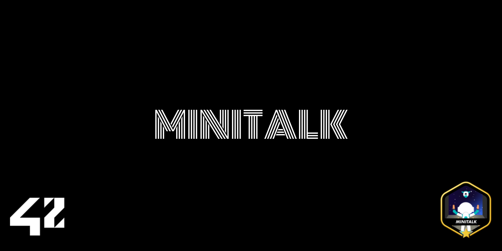

<div align="center">
<h1>42 - MiniTalk</h1>



</br>
</br>

<strong>A small data exchange program using UNIX signals 📡</strong>

<p>The purpose is to create a communication program in the form of a client and server using only UNIX signals SIGUSR1 and SIGUSR2.</p>

</br>

<p><a href="https://github.com/MathysCogne/42_Mini_Talk/blob/main/subject/fr.subject.pdf"><strong>Subject</strong></a></p>

</div>

## Features

</br>
<div alignitems="center">

### Mandatory Requirements:

- **Server Program:**
  - Displays its PID on launch
  - Receives and prints strings sent by clients
  - Must be able to receive strings from several clients in a row
  - Must display the string quickly

- **Client Program:**
  - Takes two parameters:
    - Server PID
    - String to send
  - Communicates with server using UNIX signals
  - Must send the string to the server
  - The server must display the string fairly quickly

</br>

### Bonus Features:

- **Server acknowledgment:** The server acknowledges every message received
- **Unicode characters support:** The program supports Unicode characters

</div>

</br>

## Compilation and Usage

</br>

```bash
# Compile:
make

# Start the server:
./server

# Send messages using the client:
./client [SERVER_PID] "Your message here"

```

</br>

## Disclaimer
> At 42 School, most projects must comply with the [Norm](https://github.com/42School/norminette/blob/master/pdf/en.norm.pdf).